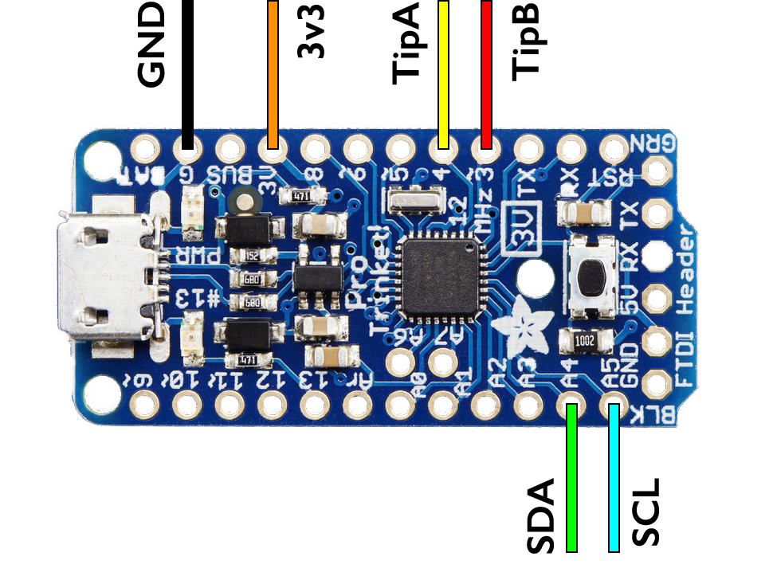
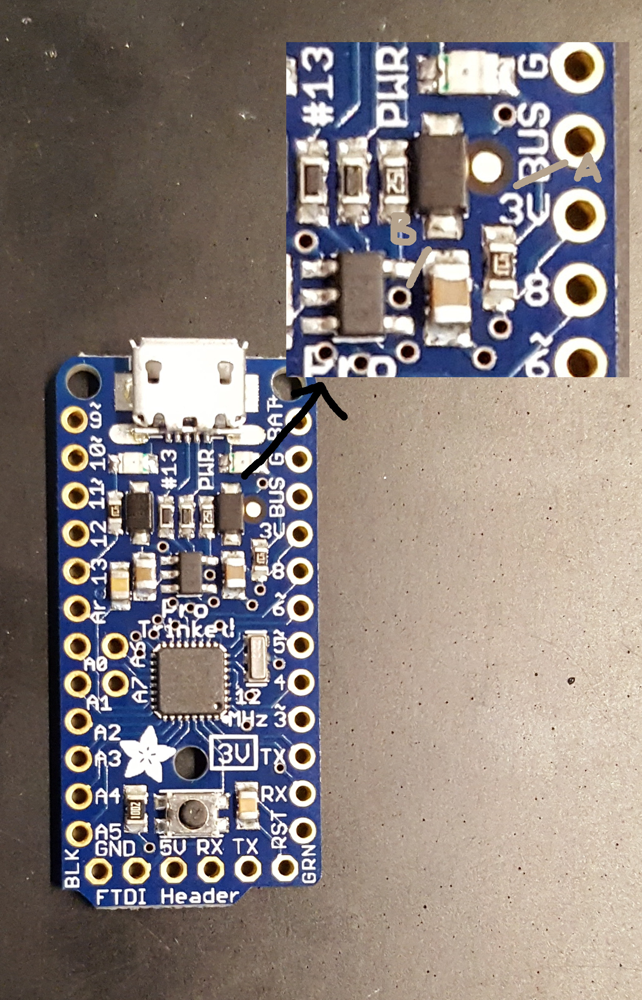

# TippingBucketRainCounter I2C Slave Device
Arduino code & instructions to convert an [Adafruit Pro Trinket 3V board](https://www.adafruit.com/product/2010) into a tip counter for a tipping bucket rain gauge. Th Pro Trinket monitors tips and acts as an I2C slave to a main data logger board, such as the EnviroDIY Mayfly.

Tips on how to program Adafruit Trinket Pro:
* Add the Adafruit Board Support package! https://cdn-learn.adafruit.com/downloads/pdf/adafruit-arduino-ide-setup.pdf
* Follow this guide carefully: https://learn.adafruit.com/introducing-pro-trinket/setting-up-arduino-ide
  * Note that you will not see the Pro Trinket show up as a COM port, but it can still accept programs over USB when in Bootloader mode (when the red LED is pulsing).
  * If the red LED is not pulsing, press the button on the Pro Trinket, pause for it to start pulsing, then upload the program.

Load this file the Pro Trinket, which serves as an I2C Slave for this application:
* `Slave_TippingBucket_Test_LowPower.ino`

Load this file to test on your data logging board, such as the EnviroDIY Mayfly, which serves as an I2C Master:
* `Master_Test.ino`

## Wiring Guide
The wiring of the slave to the master is shown in the following graphic, where 3v3, GND, SDA, and SCL come from the master device (I2C), and TipA and TipB are the two lines connecting to the tipping bucket rain gauge (these lines are generally interchangeable).

Note that the Pro Trinket needs to always have power available, so if connecting to the EnviroDIY Mayfly I2C grove port, switch the jumper to non-switched power.

## Reducing Power
The power consumption of the Pro Trinket can be greatly reduced by cutting two connections on it's printed circuit board.

**Power Reduction A (recommended)** is to disconnect the green "Alive" LED. Cutting trace A only disconnects the green alive LED and has no impact on functionality, other than not having the green LED turn on when power is applied.

**Power Reduction B (pros only)** is to disconnect the on board 3v3 regulator from the 3v3 line in order to reduce reverse current leakage. **Do this with caution**, as cutting trace B disconnects the regulator from the USB input. This means that once this trace is cut external power will be required to program the device. This modification is only recommended if extreme power reduction is required! The results of this are not nearly as significant as disconnecting the alive LED (As can be seen in the current table below), and can make things more difficult to work with.

Both of these modifications are made by cutting a trace on the PCB using an XActo knife or metal scribe. Disconnecting of the alive LED is done by cutting trace "A" in the figure below, and disconnecting of the regulator is done by cutting trace "B". With either option proceed with caution and of course do not take a knife to anything you are not willing to sacrifice!

The current consumptions for all of these configurations is shown in the table below.

### Power Consumption in Sleep

The vast majority of the time the slave is in sleep mode, so this is the current consumption we primarily care about, the following table show the current consumption of a Trinket Pro running the low power slave code with various hardware modifications, all tests performed with an input votage of 3.3v

Moddification | Current [mA]
------------ | -------------
None | 2.9
Cut Trace A | 0.1
Cut Trace A & B | ~0.05

As you can see, disconnecting the alive LED has a very significant impact on the current consumption, the disconnecting of the regulator does reduce current further, but not nearly so dramatically and it does make working with the device more difficult, so for most applications it is probobly not worth it.
